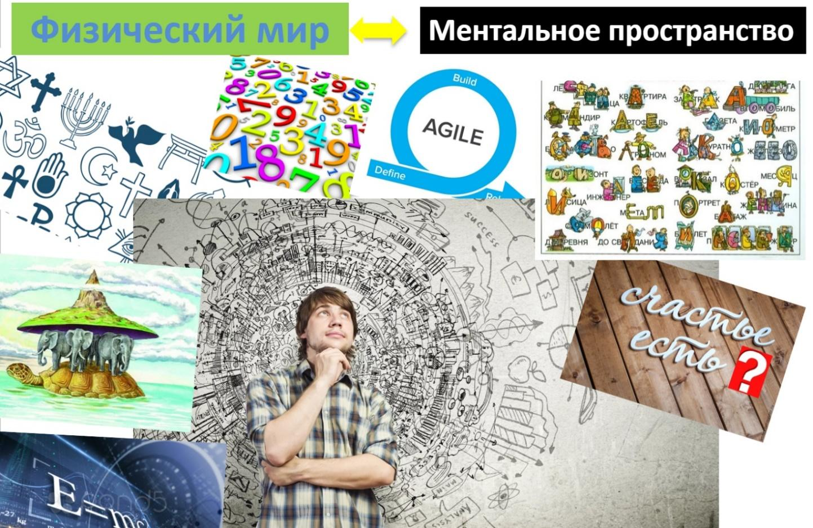

# 1.1. Что такое ментальное пространство

> **Основные понятия:** физический мир, ментальное пространство, техноэволюция, экзотело.

### Как человеку удалось стать самым развитым существом на планете?

Одна из гипотез состоит в том, что на каком-то этапе развития человечеству помогло сочетание двух конкурентных преимуществ, которые одновременно не проявлены у других животных. Это способность объединяться в большие группы и сплочённо реагировать на изменения внешнего мира. Homo sapiens научились консолидировать и направлять коллективные ресурсы на общее дело: от совместной охоты на животных до реализации космических программ.

На определённом этапе возникновения и развития человеческого общества люди научились передавать информацию с помощью знаков. В этом человек не оригинален — у животных тоже существуют свои знаковые, жестовые и звуковые методы коммуникаций. Но человеческая коммуникация, также основанная на животных инстинктах, переосмыслилась — из звуков и жестов возникли слова и язык.

Язык позволил общаться по поводу прошлых событий и других не сиюминутных ситуаций, возникло изобразительное искусство, демонстрирующее способность мысленно представлять то, чего нет, и изготавливать всё более сложные инструменты, соответствующие мысленному шаблону. Один человек смог передавать свои ментальные представления группе, количество взаимодействующих людей постоянно увеличивалось, как и скорость коллективной адаптации к внешнему миру.

На протяжении всей человеческой истории знаковая система развивалась — люди придумали рисунки, буквы, числа, ноты — символы и обозначения, которые заменяют что-то другое. Можно условно сказать, что человек создал ещё один, параллельный «мир» — сложное **ментальное пространство**, в котором мы понимаем и дешифруем знаки, наблюдаем, оцениваем, планируем, и только потом начинаем действовать.

*Рис. 1.1. Связь физического мира и ментального пространства*

Слова — знаки, отражающие ментальное пространство, продукт интеллектуальной деятельности человека. Со временем человек научился не только обозначать — указывать знаками на предметы — но и описывать их, а затем пошёл ещё дальше, сформировав такие сложные абстрактные понятия как бог, религия, любовь, мораль, которые не представлены в мире как физические объекты. И если остальной природный мир подчиняется законам эволюции, то с появлением ментального пространства у человека можно говорить уже о радикальной и сложной инновации в эволюционной инженерии и **техноэволюции**.

Через знаковое описание понятий ментального пространства происходило и происходит сближение людей для достижения общих целей. Цели могут быть очень разными — и далеко не всегда позитивными — но результат налицо: люди сумели найти способы описания мира, продумывания изменений в нём, а впоследствии и его коллективного изменения. Человеческая модель воздействия на внешний мир оказалась лучше, чем у животных — поэтому человек смог создать развитую цивилизацию.

### Разница миров животных и человека

Если сказать обезьяне: «Дай банан, за него ты получишь лишённую страданий загробную жизнь», или: «Дай банан, а я дам тебе 100 долларов», то обезьяна этого не поймёт. Люди же прекрасно поймут обе фразы, потому что научились связывать знаками физический и ментальный миры.

Слабая — по сравнению с другими животными — приспособляемость человека к природной среде обернулась силой, когда люди научились договариваться, осуществлять совместные планы и передавать свой опыт другим для изменений в среде обитания (социальное наследование). Способность действовать не в прямой реакции на непосредственные ситуации, но вкладывая время (ресурсы) в то, чтобы отступить назад, спланировать изменения и развить нужные для этого новые умения — выделяет человека из мира живой природы. Человек меняет жизнь вокруг себя, применяя полученные знания и устраняя свои неудовлетворённости.

Ментальное пространство помогло человеку усилить свои биологические функции. Например, эволюция дала человеку зрение и способность передвигаться на своих ногах. Однако техноэволюция эти природные функции усилила: микроскоп, бинокль, роликовые коньки и велосипед могут восприниматься как **экзотело** — продолжение, расширение биологического тела. Экзотело — это все предметы, с помощью которых усиливаются функции современного человека, так же как на ранних этапах антропосоциогенеза усиливались природные функции древнего человека, когда он брал в руки камень. Биологическое тело развилось в ходе эволюции, а экзотело появилось и развивается в ходе техноэволюции.

### Картины мира

Придуманные человеком понятия и научные теории помогают не только описывать физический и ментальный миры, усиливать биологические функции человека, обеспечивать удобство и комфорт жизни, но и наполняют жизнь смыслом, открывая возможности бесконечного развития — в познании бесконечно удивительного мира. В отличие от животных, человек, влекомый интересом, может не только откладывать удовольствия, но и рисковать собственной жизнью. Познание помогает лучше прогнозировать внешние изменения и быть готовым к неопределённому будущему.

Существует распространённое мнение о том, что каждый человек уникален — у каждого своя «картина мира». Но на интуитивном уровне все люди примерно одинаково воспринимают и моделируют мир. Над этим потрудилась эволюция, которая вшила в каждого индивида одинаковое восприятие физического мира. Дождь, снег, любые погодные явления, человеческие эмоции или угрозу жизни современные люди воспринимают примерно одинаково. В человеческом мозге, как и в мозге животного, есть природный моделлер, который на автомате распознаёт (вычисляет) ситуации в физическом мире и принимает большинство решений.

На различие в восприятии влияют те элементы картин мира, которые «загружаются» в человека в течение всей жизни, а на основе опыта формируются убеждения, ценности и цели. Сначала человек учит простые знаки — слова, которые обозначают то, что его окружает — «мама», «папа», «мальчик», «девочка», «кошка», «дерево», затем осваивает житейские понятия — «счастье», «любовь», «бог», «чувство». Далее — сложные научные понятия — «энергия», «масса», «ускорение». Понятия разных уровней сложности помогают мышлению, с их помощью происходит компактизация знания, лучше удерживается внимание на важном и человек точнее совершает действия. К тому же, человек может выработать и многократно переиспользовать одинаковые ходы (приёмы) мышления в разных житейских и рабочих ситуациях.

Объединяя понятия взаимосвязями, человек создал теории, которыми описывает или моделирует реальность. Накопление массива теорий выплеснулось в научно-техническую революцию, благодаря которой за несколько веков количество людей увеличилось в десятки раз, а производство — в сотни.

Накопление знания — нескончаемо увлекательное приключение для человечества. Мозг человека любопытен, жаждет новой интересной информации, меняет ходы мышления, приспосабливаясь к быстро меняющейся действительности. Человеку изначально присуща внутренняя мотивация к развитию, а пластичность мозга даёт большие перспективы для бесконечного развития. При этом каждый человек может осознанно выбрать в развитии свой собственный путь.

Каждый человек носит в себе огромное количество информации, накопленной за жизнь. Но чтобы сделать первый шаг к осознанному развитию, важно научиться различать знания, принципиально разные по качеству — достоверные и недостоверные, научные и ненаучные.
