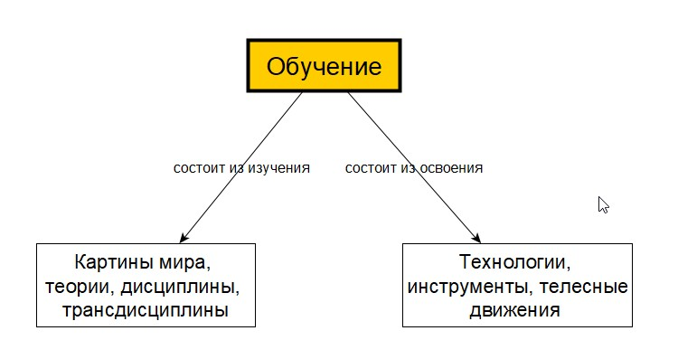
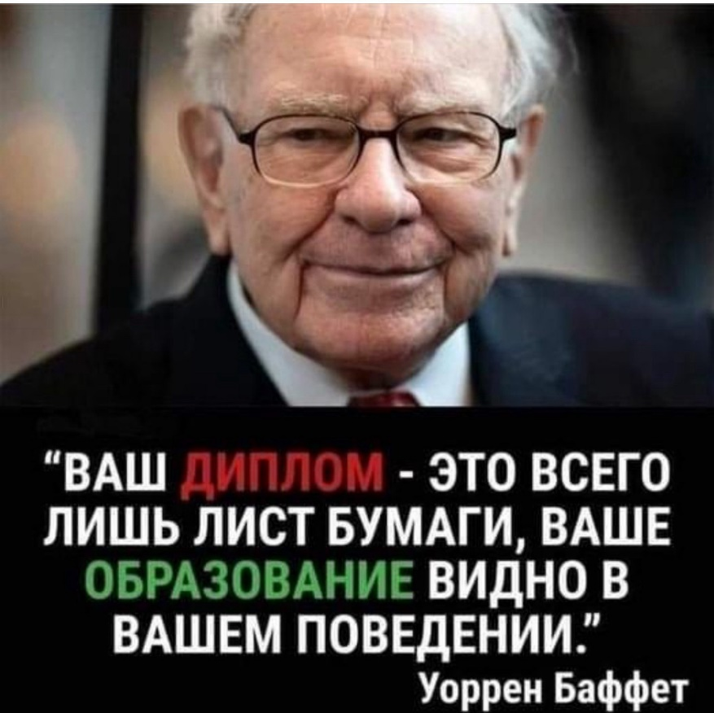

# 2.1. Обучение

> **Основные понятия:** инженерия, личность, агент, тело, экзотело, мозг, экзокортекс, агентность, мастерство, ресурсы, обучение, образование, образованность, профессионализм, мастерство, осознанное и неосознанное обучение, форма обучения, содержание обучения.

### Обучение как инженерия

Слово «обучение» знакомо каждому с детства. Но мы посмотрим на понятие «обучение» с инженерной точки зрения. Инженерия — это общее понятие для деятельности по созданию любых систем. Существуют конкретные инженерные методы в разных сферах деятельности, посредством которых создаются определенные системы. Например, инженерия по созданию системы «дом» будет называться строительством, а инженерия по приготовлению еды — кулинария. То есть в конкретной сфере деятельности обобщенную (транс)дисциплину «инженерия» называют конкретной дисциплиной.

Отсюда, «обучение» — это тоже инженерия, но из предметной области развития личности. То есть мы можем обобщенно говорить, что обучение — это инженерия (создание) личности, но можем конкретно сказать, что речь идет об обучении личности. В результате инженерии-строительства получается система «дом», в результате инженерии-стоматологии получается «запломбированный зуб», а за счет инженерии-обучения получается «личность». Поэтому результат любого конкретного обучения — это мастерство.

Ещё можно вспомнить, что понятие «обучение» используется при создании ИИ, и говорят о глубоком и машинном обучении. С другой стороны, в обучении личности часто приводят аналогию с программированием поведения человека, что также недалеко от сути, поскольку мастерство можно рассматривать как исполняемые программы.

Исходя из модели личности можно сказать, что в процессе обучения мы получаем следующее:

- высокую агентность, которая формируется за счет того, что желания и неудовлетворенности касаются больших идей (большой калибр личности);
- сильный интеллект, который характеризуется образованностью;
- прикладное мастерство, которое характеризуется профессиональностью.

Для поднятия агентности люди часто проходят обучение так называемому личностному росту. Такое обучение направлено на то, чтобы человек «встал с дивана» и начал что-то делать, ведь так или иначе любое действие повышает вероятность изменений. Агентность развивается с детства, например, этому способствует научная фантастика. Кроме того, агентность развивается за счет расширения кругозора и систематического потребления качественной информации об устройстве мира и цивилизации. Результат развития агентности — это действующий агент, то есть он постоянно и систематически совершает какие-то действия для того, чтобы улучшить свое положение и/или избежать проблем. Для наведения внимания на свою агентность желательно в рамках стратегирования описывать свои неудовлетворенности, цели и приоритетные проекты.

Обучение мыслительному мастерству (усиление интеллекта) называется образованием. То есть образование — это обучение личности трансдисциплинам интеллект-стека. А образованность — это только характеристика интеллекта, а не всего жизненного мастерства, в которое входит ещё прикладное (профессиональное мастерство). Развитие образованности является основной целью Мастерской инженеров-менеджеров. И поэтому мы обучаем трансдисциплинам интеллект-стека, о котором поговорим в следующих разделах.

Обучение прикладным дисциплинам можно назвать профессиональным обучением. По итогам такого обучения личность повышает свой профессионализм в определенном прикладном мастерстве. Рабочий продукт прикладного мастерства — это конкретная система (дом, кулинарное блюдо, ИТ-программа) или документация (бухгалтерский баланс, концепция системы и т.п.). Профессионал обычно создает рабочий продукт быстрее и качественнее, чем любитель. Часто профессиональные сообщества присваивают квалификации по уровню мастерства.

Таким образом, обучение как инженерия может применяться в отношении следующего:

- развития агентности;
- образования или усиления интеллекта;
- обучения профессиональному методу.

В обучении можно выделить два процесса. Первый — это процесс «закладки» или «помещения» в голову картин мира (теорий) из ментального пространства мира, а второй — это тренировка и освоение связанных с этими картинами инструментов (технологий) в физической реальности.

*Рис. 2.1. Два процесса обучения: изучение теории и освоение технологии*

Например, бухгалтер изучает метод под названием бухгалтерский учет. Название метода обычно называется по названию дисциплины. Дисциплина бухгалтерского учета включает в себя такие понятия, как актив и пассив, а также в ней определяются принципы. Инструментами бухучета могут быть Excel или бухгалтерская программа SAP. Невозможно пользоваться инструментами (технологиями) или изучать их, не зная теории. Рабочим продуктом бухгалтерского учета будут появившиеся в физическом мире документы — бухгалтерский баланс или отчет о прибылях и убытках.

Обучение может быть осознанным и неосознанным. Под неосознанным мы будем понимать обучение, когда человек не встает осознанно в роль ученика, то есть не использует соответствующие методы (практики саморазвития). Неосознанное обучение происходит не только когда социальная среда влияет на человека, а, например, когда учат как бы исподволь, применяя игровую форму обучения, или когда не обращают внимание на понятия, принципы и другие ментальные объекты каждой теории.

Исполнение роли ученика опирается на способность агента управлять своими неудовлетворенностями (желаниями) и откладывать их устранение, чтобы сосредоточиться на интеллектуальной работе. Ведь для обучения необходимо время, которого может быть недостаточно для быстрого получения положительного подкрепления. Поэтому часто пройти сложное обучение неподготовленный человек (не умеющий исполнять роль ученика) не способен, он постоянно срывается и не заканчивает начатое обучение. С большой вероятностью, он не понимает, чему он обучается (интеллект, профессиональное мастерство), как устроено обучение и как его можно ускорить, чтобы быстрее получать положительные результаты. Именно получаемые рабочие продукты формируют положительную обратную связь и придают смысл обучению. А осознанное обучение удерживает внимание на методах обучения и на результате в виде рабочих продуктов.

### Общественный взгляд на обучение

В создании личности задействовано большое число людей, многие из которых необязательно являются учителями. Человек обучается всю жизнь, но большую часть жизни человек учится неосознанно. Ребенка учат родители, воспитатели в детском саду, учителя в школе и вузе, наставники на работе. Реклама тоже обучает человека. Например, как правильно использовать новинки прогресса.

*Рис. 2.2. Множество участников в обучении человека*

Обучение в широком смысле — это процесс «помещения» в мозг человека моделей или картин мира. Хорошие картины мира повышают вероятность хороших решений, а плохие могут даже поставить крест на передаче генов. Риск неправильного решения с развитием цивилизации перестал быть фатальным, последствия плохих решений наступают не сразу, и даже не всегда понятно, какое именно из множества повседневных решений привело к неудаче. Плохие картины мира живут промеж людей и в современном мире выбраковываются медленно. Бабушка может передать свой жизненный опыт наряду со своими предрассудками. Учебное заведение может учить хорошей предсказательной научной теории, а может учить устаревшему знанию прошлого века. Обучение научным и ненаучным картинам мира сопровождает человека всю жизнь, и часто человек потребляет их вперемешку.

При обсуждении обучения в широком смысле важно сначала понять, с какой точки зрения мы смотрим на этот важный процесс. Как мы уже знаем, на реальность можно посмотреть с разных точек зрения. Результаты рассмотрения хоть и будут не совпадающими, но верными: общественный или личный взгляды одинаково имеют право на существование.

В течение всей истории образованная элита по-разному относилась к целесообразности распространения знания, видя в этом то положительные, то отрицательные последствия для себя или для общества. Совсем необразованные люди могут угрожать элите физической расправой, а слишком образованные — её особому статусу и привилегиям.

В настоящее время нет публичных дискуссий о пользе образования, право каждого человека на обучение закреплено национальными и международными правовыми актами. Однако соотношение научных и ненаучных картин мира, доносимых до масс, далеко не в пользу первых.

Невозможно говорить, что обучение человека происходит только в школе, вузе и на курсах повышения квалификации. Большое количество людей, участвующих в обучении человека в течение жизни, преследуют свои цели и передают информацию (знания), которую считают важной для человека или для себя. Обучение происходит в семье: родители заинтересованы в личном счастье для ребенка, но не всегда передают современное мировоззрение или могут помочь выбрать профессию будущего. Государство старается воспитать послушного, патриотичного и продуктивного члена общества, но не может гарантировать достойной жизни и востребованности. Рекламодатель продвигает норму поведения с учетом своего продукта, но может преувеличивать исполнение желаний и удовлетворение потребностей покупателя.

Шаблонное мышление притягивает своей простой и пропагандируемой универсальностью. Корпорации и небольшие компании, государственные администрации и общественные организации, а также СМИ, блогеры и другие поставщики контента быстро доносят свои картины мира до массовой аудитории. Любому человеку понятнее и спокойнее, когда есть шаблон действий.

В любой сфере деятельности каждый стремится получить алгоритм, то есть такую пошаговую инструкцию — делай раз, два, три. Но одно дело, когда сформирована способность вырабатывать для себя такие «1, 2, 3,...» в новом деле, а другое дело, когда человек не может действовать без подсказки. Задавая якобы простой вопрос, человек часто раздражается, если не получает эти пошаговые инструкции в качестве ответа. Шаблонное мышление потребителя формируется, когда человеку в удобной и простой форме доносят определенные модели мира, по которым он живет и принимает решение на автомате. Учебные заведения, гарантирующие общий минимальный стандарт, также закладывают шаблонность мышления. Шаблонность мышления — это не зло, зло — это плохие шаблоны и их неосознанное применение в неподходящих ситуациях, а также отсутствие достаточного интеллекта для выработки необходимых алгоритмов.

Если мы не осознаем воздействие окружающей среды, которая транслирует человеку шаблонные модели мира, мы не можем говорить про личный взгляд на образование. В детском возрасте сложно уклониться от отрицательных воздействий государственной образовательной системы. Но в зрелом возрасте разборчивость в картинах мира и понимание целей поставщиков контента должно отрезвлять человека. Создатель может самостоятельно задавать требования к личному образованию.

Сам человек тоже участвует в образовательном процессе, занимается саморазвитием или осознанным обучением. Но одно дело — когда выбор делался за тебя, а другое дело — самостоятельно разбираться: зачем, чему и как учиться в течение всей жизни. Этому не учат в школе или вузе. Поэтому часто ответы на эти вопросы даются исходя из общепринятых моделей мира или, как говорят, интуитивно, то есть «к чему душа легла».

Но «душа», скорее всего, будет лежать к той же общепринятой модели мира, которую вы неявно почерпнули из социальной среды: родители так говорят, друзья так думают, блогеры рассказывают, звезды и лидеры мнений так рекомендуют. При этом обучение сложным контринтуитивным теориям всегда будет проигрывать простым и красиво упакованным историям, легендам, постам инфобизнесменов и т.п. Чтобы не оказаться в море общественных шаблонов, необходимо плыть по собственной образовательной траектории.

В современной модели образования все ещё сохраняются остатки классового подхода, когда в каждой стране существуют элитные заведения. Привилегированные учебные заведения отличаются не только программой и выдающимся профессорским составом, но и тем, что в них осуществляется специальный отбор людей. Миссия Мастерской инженеров-менеджеров состоит в том, чтобы дать возможность широкому кругу людей получить современную базу мыслительного мастерства, которая не только не уступает той, что дают в лучших элитных учебных заведениях, но и превосходит её.

### Саморазвитие

В мире всегда найдется большое число заинтересованных лиц, которые захотят владеть вниманием человека, формировать его личность, определять его желания и формировать мировоззрение. Хотите вы того или нет, но невозможно увернуться от влияния окружения, если вы только не живете вне социума. Поэтому самый важный навык современного человека — это навык саморазвития, когда вы сами хотя бы на небольшую долю можете влиять на свое развитие.

Получается, что человек должен вставать в мета-роль учитель-для-себя, чтобы постоянно развивать свою личность. А потом уже улучшенное, новое жизненное мастерство позволит справиться с текущими неудовлетворенностями, то есть поможет вытащить себя как барон Мюнхгаузен из сегодняшнего болота и из будущих проблемных ситуаций.

Профессиональный операционный менеджер, IT-специалист или пловец могут учиться одинаково по форме, хотя каждый будет изучать свое содержание и будет иметь свое уникальное жизненное мастерство. Специалиста сложно научить профессиональным навыкам, он может лучше это сделать сам. Учитель-для-себя один и тот же для любого человека. Он владеет фундаментальным навыком — «умением учиться», и этот навык можно осознанно развивать. За умение учиться отвечают практики саморазвития. Это форма обучения.

Метафора Мюнхгаузена помогает осознать, что человеку нужно стать хорошим учителем для самого себя. Конечно, будут и другие учителя, но взрослому человеку нужно, как минимум, понимать, чему и как ему учиться. Чему учиться — это содержание обучения, а как учиться — это форма обучения.

Саморазвитие также означает, что человек может с большей эффективностью пользоваться интеллектом других людей и использовать экзокортекс. Обучение человека будет проходить не только путём «внешнего программирования». Он будет выдвигать собственные гипотезы и уточнять имеющиеся у него объяснения по мере получения знаний о реальном мире от других интеллектов. В итоге случится озарение как результат субъективного опыта.

Получается, что взрослый человек обучает сам себя в роли учитель-для-себя и потом сам же проводит валидацию полученных знаний на практике. Такой опыт получает человек (формирует убеждения), погруженный в социальную (образовательно-рабочую) среду. В этой связи метафора Мюнхгаузена требует продолжения. Человек должен не только вытащить себя из болота проблем, но и погрузить себя в продуктивную социальную среду.

Саморазвитие означает, что на протяжении всей жизни нужно следить за своим окружением, поскольку правильная среда помогает личности развиваться с наименьшими усилиями. При этом социальное окружение представляется как совокупность систем и других интеллектов, которые предоставляют вам услуги обучения или сервис проживания с целью получения продуктивного опыта.

Для того, чтобы чему-то научиться, нужно это прожить. И поэтому «болото» в метафоре Мюнхгаузена тоже имеет важный смысл. Оно может быть проблемой, из которой человек себя вытаскивает за счет умения учиться и нового жизненного мастерства. А с другой стороны, «болото» можно заменить продуктивным окружением, в которое человек себя погружает, чтобы получить опыт, быстрее и продуктивнее развиваться.

Каждому современному человеку приходится постоянно «переизобретать» себя заново. И метафора Мюнхгаузена объясняет, что любой высококлассный специалист помимо своих профессиональных практик должен обучать себя практикам саморазвития и трансдисциплинам интеллект-стека. А любому попавшему в «болото» нужно обратить внимание на свое жизненное мастерство и развивать его, используя умение учиться.

### Образованность и профессионализм

В прошлом разделе мы ввели понятие образование, которое закрепили за обучением личности трансдисциплинам интеллект-стека. А образованность — это только характеристика интеллекта, а не всего жизненного мастерства, в которое входит ещё прикладное (профессиональное мастерство).

Если не учить физику, то весь мир будет казаться волшебством. Это утверждение во многом логично, поскольку знания физики позволяют нам понимать основные принципы функционирования окружающего мира. Но это утверждение можно расширить и на другие области знаний. Ведь образованность не ограничивается одной трансдисциплиной. Она представляет собой широкий спектр фундаментальных знаний и мыслительных навыков, позволяющих человеку адекватно воспринимать и интерпретировать события, происходящие в мире. В том числе на основе частного выявлять общие закономерности, паттерны и ставить гипотезы на будущее.

Образованность отвечает за фундаментальную, а профессионализм касается прикладной части жизненного мастерства. Об образованном в культуре говорят как об интеллектуале, а о мастере в конкретном прикладном деле говорят как о профессионале. В одном человеке сочетается общая образованность и конкретные профессиональные навыки (мастер в каком-то деле).

Считается, что у вас хорошее образование, если вы можете давать хорошие объяснения различным ситуациям и неожиданностям, которые происходят в жизни (включая работу). Это означает, что вы не просто запоминаете или знаете факты, но понимаете принципы и закономерности, лежащие в основе этих фактов. Высокий уровень образованности означает, что человек имеет лучшие знания по трансдисциплинам интеллект-стека.

Профессионализм же является характеристикой прикладного мастерства. Высокий профессионализм (обязательно в чем-то) говорит о том, что человек является мастером в определенной области. Например, Лионель Месси считается одним из величайших футболистов всех времен благодаря своему выдающемуся мастерству на футбольном поле. Но сложно что-то сказать о его образованности, потому что потребуется совсем другая информация о нем.

*Рис. 2.3. Образованность и профессионализм — разные характеристики личности*

Примером того, как фундаментальные знания помогают объяснять явления, может служить радуга. Для многих людей радуга — это нечто волшебное и таинственное. Однако, зная основы оптики и физики света, можно понять, что радуга возникает из-за преломления солнечного света в каплях воды в атмосфере. Это знание делает радугу не менее красивой, но при этом объясняет её природу и делает восприятие мира более полным и осмысленным.

Точно также образованный человек может находить объяснения в работе или личной жизни. Это поведение заметно окружающим. Он буквально одержим познанием и желает находить лучшие объяснения и, таким образом, обогащая свое мировоззрение и помогая другим познавать мир или реализовать проекты. Например, вам может понравиться находить объяснения не только в рамках рабочих проектов, но и многим цивилизационным понятиям через системное мировоззрение. Например, что такое культура, искусство, эволюция и техноэволюция, элита, политика, смысл жизни и т.п. Поэтому получается, что фундаментальное образование необходимо развивать непрерывно и бесконечно, а не один раз заканчивая вуз.

Таким образом, образованность и профессионализм — это разные понятия, но они вместе характеризуют жизненное мастерство и играют ключевую роль в понимании мира и самих себя. Они позволяют не только адаптироваться к меняющимся условиям жизни, но и продолжать развиваться, открывая новые горизонты знаний и умений.
