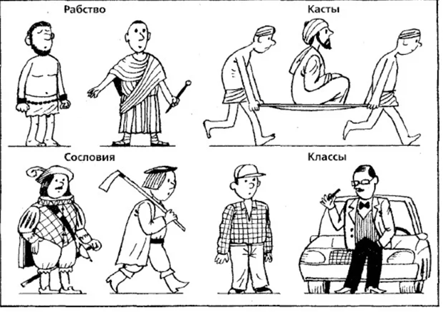

# 1.7. Плюсы и минусы прогресса

> **Основные понятия:** потребление информации, простота для пользователя, сложность для создателя, удержание внимания, расслоение общества, поведение создателя, поведение потребителя, прогресс.

### Сложность мира

Научной революции насчитывается около 500 лет. За это время человечество создало многочисленные теории и описания физического мира, что позволило не только вырваться за пределы Земли, но и создать единое информационное пространство. Стандарты качественной жизни стали во всем мире сравнительно одинаковы — ценится крепкая валюта и благополучие, теплая вода и другие удобства в доме, бытовая техника и средства передвижения, доступ к медицине и интернету. Для большинства людей решены базовые потребности, связанные с безопасностью и пропитанием.

Наука не стоит на месте, и визионеры пророчат каскад технических революций. Можно запутаться, какая у нас по счету промышленная или техническая революция — 4-я или 5-я, да хоть бы и 10-я. Важен общий тренд на то, что обывателю приходится все меньше напрягаться, чтобы удовлетворить свои простые потребности. Жизненные удобства, которых раньше не имели и короли, в XXI веке норма для большинства населения. Жизнь человечества становится все более комфортной, производители готовы удовлетворить любое желание клиента, борясь между собой за потребителя. Тем, кто не рос во времена дефицита товаров и услуг, сложно понять, что может быть как-то иначе. Вероятно, через пару десятков лет уже следующее поколение будет удивляться, как так можно — болеть и жить менее 100 лет.

Несмотря на качественное изменение жизни большей части человечества, на уровне отдельного человека все выглядит не так радужно. Многие люди не готовы справиться со свалившимся на них «счастьем» в виде свободного времени. Каждый плюс цивилизации для всего человечества имеет свою обратную сторону для конкретного человека. И если конкретная личность не понимает, как пользоваться плюсами прогресса и избегать его негативного влияния, то не находит своего места в социуме, а ее агентность снижается. Личность живет в постоянном стрессе, находится в постоянном «поиске себя» или удаляется от цивилизации. Или наоборот, борется с глобализацией, являясь заложником черно-белого мышления.

### Три пары плюсов и минусов прогресса

**Первая пара плюсов и минусов прогресса** — это доступность информации с одной стороны, и ее засилье с другой. Современный мир связан единым инфопространством, поэтому информацию (идеи, теории и модели мира) не только не сдерживают никакие границы — она моментально преодолевает любые расстояния. С другой стороны, на человека обрушился огромный информационный поток. К чему это привело:

- потребление информации стало занимать большую часть жизни обывателя, а времени на размышления остается все меньше;
- качество потребляемой информации снизилось;
- удерживать внимание становится все сложнее.

Соцсети, реклама, развлекательные ресурсы, медиа и другие поставщики информации, конкурируя за внимание человека, выдают готовые решения, над которыми не нужно думать. Массовый спрос на экономию мышления порождает лавины упрощенного до примитивности контента, но который приносит финансовые ресурсы — для повышения технического качества и улучшения средств его доставки. Экономика — и ничего личного, а вот саморазвитие — личное дело каждого человека.

Скормленная удобным для потребителя образом информация создает эффект начитанности и осведомленности, а чужие ментальные объекты легким нервным импульсом складываются в «собственное мнение» по любым вопросам. Отсюда плеяды выдающихся диванных аналитиков и экспертов по психологии, обучению, вирусам, экономике, воспитанию детей, лечению, управлению государством.

Простые и легко понимаемые модели мира обычно подходят для решения таких же незамысловатых задач, но не позволяют решать сложные. Бесцельное времяпрепровождение в соцсетях и играх цементирует достигнутый уровень человека, в перспективе — с неизбежным откатом вниз. Доступность и засилье информации требует навыка поиска и отбора нужной и качественной — для личного развития и реализации проектов. Поэтому нужно развивать мыслительное мастерство (интеллект) и чтить технику информационной безопасности.

Систематическое потребление любого количества даже качественной информации недостаточно для быстрого саморазвития. Потребление информации — это не мышление и не полноценное обучение, даже если человек проглатывает одну книгу за другой. Залипая в соцсетях или только читая, человек не выделяет достаточного времени на размышления, которые помогают переработать и усвоить получаемую информацию. Мышление как функция мозга проявляется в те моменты, когда человек разбирается в новом деле или в новых понятиях, теориях, моделях, но при этом обязательно оставляет следы своих размышлений в виде записей. Безусловно, чтение книг и изучение сложных теорий намного лучше, чем трата времени на комфортное залипание в интернете, но для качественного усвоения информации — и обучения собственной нейросетки — практика мышления письмом дает наилучшие результаты.

Помним, что легко усваиваются только простые модели, а вот для овладения сложными теориями необходимо выделять время и думать, а не только читать. Эти размышления — ежедневные тренировки для мозга, развивающие интеллект. Если нет интересующих тем, таких, над которыми хочется задуматься, то важно вновь и вновь обращаться к своим неудовлетворенностям, расширять кругозор, а если не получается мыслить текстом — что часто встречается на первом этапе обучения — то нужно ставить практику мышления письмом.

Еще одна проблема засилья информации — сокращение времени удержания внимания. Яркий, но пустой инфопоток цепляет внимание, втягивая человека в поглощение привычного и малозначимого. Мозг на такую информацию активно реагирует, не задерживаясь на размышлениях. Избалованные легким и доступным контентом, обыватели теряют навык длительной концентрации внимания, теряют способность игнорировать мельчайшие внешние раздражители. Человек, способный целенаправленно, методично, в течение нескольких месяцев ежедневно посвящать 1–2 часа на изучение сложной теории или метода, сегодня большая редкость. Однако навык удерживать внимание в течение часов, дней, месяцев и лет необходим — для постановки привычек, развития жизненного мастерства и изменения мышления. Первый шаг для выработки этого навыка — ограничить увлечение пустым контентом соцсетей, который негативно влияет на время удержания внимания.

**Вторая пара плюса и минуса прогресса** — простота мира для пользователя и сложность для создателя. Пользователями бытовых технических устройств уже становятся маленькие дети — чтобы пользоваться техникой, не нужно усердно учиться. Но чтобы стать и оставаться востребованным специалистом, необходимо учиться всегда, постоянно осваивая сложные знания и технологии. В этом состоит парадокс простоты и сложности современного мира. Технологическое развитие привнесло в повседневную жизнь многообразие продуктов и услуг, которыми удобно и комфортно пользоваться — но это не простота, это иллюзия простоты.

В обществе потребления клиент не только «всегда прав», он ещё и не должен напрягаться. Например, смартфон должен быть интуитивно понятен и прост в использовании. Но кто сказал, что так должно быть во всем? Например, почему обучение мастерству создания смартфонов должно быть приятным и простым занятием, да еще и в игровой форме?

Стажер с низким уровнем осознанности невольно переносит потребительский взгляд и на обучение, и на созидательную деятельность. Конечно, для потребителя создано множество продуктов и сервисов, повышающих качество жизни — это, бесспорно, хорошо. Но сложность мира никогда никуда не исчезает, она переходит на другой уровень. Чтобы потребителю было просто, разработчик должен взять всю сложность на себя, а именно — использовать собственные ресурсы, чтобы создать функциональный и интуитивно понятный в использовании продукт. Потребителю тоже нужно быть начеку: «То, что можно сформулировать и выразить настолько ясно, что лохи поведутся — ловушка для лохов» (Нассим Талеб).

Постоянное усиление конкуренции приводит к лучшим продуктам и сервисам, но одновременно и к возрастанию сложности теорий и технологий. Простые и удобные для потребителя продукты становятся все более сложными в разработке и создании. Мир, с одной стороны, становится простым, а с другой — все более и более сложным. При этом конкурируют уже не столько технологии, но дисциплины и научные школы, которые создают лучшие методы и теории для создания успешных систем.

Транснациональные корпорации остаются лидерами не потому, что выпускают лучшие товары и сервисы. И не столько потому, что у них есть лучшие технологии для производства товаров и сервисов. Продукты и технологии — это относительно понятная и лишь видимая часть. За лучшими продуктами и новыми технологиями стоят методологии, методы или теории, которые постоянно развивают лидеры мировой интеллектуальной элиты.

Большинство людей в мире отмечает высокий уровень качества японских товаров, между тем их массовый выпуск стал возможным только потому, что в середине прошлого века японские компании вложились в методологию непрерывного качества. У японцев созданы лучшие мировые школы качества, и эти школы выпускают не продукты и технологии, они выпускают SoTA-методы — lean, kanban, toyota quality management и другие. Уже с помощью этих методов создаются технологии, а далее — товары.

Конкуренция приводит не только к многообразию продуктов и удобству их использования, но также является и катализатором повышения сложности теорий. Чтобы комфортно существовать в новом мире, человеку необходимо будет научиться любить сложность, а не избегать её. Научиться решать проблемы, не отгораживаясь от них, не делая вид, что их не существует — не игнорировать свои неудовлетворенности. Желание простоты и «волшебной таблетки» — мышление масс и потребителей, любовь к сложности — мышление создателя.

**Третья пара** связана с грядущей повсеместной роботизацией и ИИ, которая принесет большее благополучие человечеству в целом, но потребует от конкретного человека еще больших усилий, чтобы конкурировать с другими людьми за рабочие места. В прошлом веке люди получали одну профессию, и редко переучивались до конца жизни. В 21 веке активные люди периодически меняют сферу деятельности, а со временем большинство людей поймет, что регулярное переучивание — норма современной жизни.

Тренд на вытеснение человека из систем, в которых он совсем недавно играл ведущую роль, только усиливается. Так, человек был «винтиком в системе» конвейерной эры, а сейчас конвейер является вотчиной роботов. Мы стоим на пороге замены человека в роли водителя. Роль водителя в системе «автомобиль», безусловно, останется, но исполнять эту роль будет искусственный интеллект, а не человеческий.

Можете оглянуться вокруг и подумать: почему роли, которые сейчас еще исполняет человек, пока не может выполнить искусственный интеллект? Например, роботов уже научили писать музыку, быть художником, юристом и копирайтером. Какое мастерство уникально для человека и недоступно роботу? Какие профессии будут востребованы в будущем и на какое время? На этот вопрос ответить сложно, поэтому выходом является усиление интеллекта, который позволит быстро обучаться новому и сложному мастерству.

### Расслоение общества

Основные тренды развития цивилизации показывают, что расслоение между интеллектуальным меньшинством и потребляющим населением будет все более явным — разграничительная линия пройдет между создателями и потребителями. Невозможно спрогнозировать общий уровень образованности населения: он может и не особо измениться. Разделение же будет в поведении людей.

**Поведение создателя** направлено на постоянное решение новых и все более сложных проблем, расширение кругозора, усложнение интересов, создание улучшенных продуктов и сервисов, изучение и открытие новых методов, теорий и трансдисциплин, с отложенным долгосрочным эффектом на всю жизнь.

**Потребительское поведение** — это, напротив, избегание сложности, тяга к привычному, интуитивно понятному, приносящему быстрый результат, постоянное потребление информации вместо создания контента и продуктов.

Сложные новые дисциплины (теории) придется осваивать всем тем, кто не хочет быть только потребителями. Если человек становится создателем, который меняет мир и создает системы, то ему придётся брать сложность на себя. Если хотите чего-то добиться в мире, то вам придётся идти в сложность и самому становиться сложной личностью. Усилившаяся конкуренция ведет к тому, что потребителю становится все проще и проще жить (при наличии ресурсов), но создателю, наоборот, приходится решать все более сложные проблемы. Нельзя путать позиции потребителя и создателя. Например, если вы как ученик хотите обучение попроще, то вы явно спутали роль потребителя и роль создателя, которым хотите стать в процессе обучения.

Рассмотренные плюсы и минусы прогресса указывают на то, что, вероятно, произойдет расслоение общества на тех, кто сможет использовать плюсы и справиться с минусами, а также тех, кто частично будут пользоваться плюсами, но при этом не смогут даже осознать минусы и не изменят свой образ жизни. Водораздел пройдет по содержанию и сложности потребляемого контента, по отношению к сложности, по времени удержания внимания и концентрации на целях, по регулярности мышления письмом, по способности с нуля быстро осваивать новое, по использованию свободного времени и по уверенности в том, что хватит сил и интеллекта справиться с вызовами неопределенного будущего. Чтобы быть создателем, который живет интересной жизнью, необходимо сделать выбор между интеллектуальным меньшинством и потребляющим большинством.

Кроме того, нельзя не отметить еще одну характеристику, по которой происходило и будет происходить расслоение общества. Несмотря на технический прогресс, человечество в целом не достигло успехов в поиске вознаграждения внутри себя. Будда говорил о счастье внутри человека, но до сих пор большая часть людей считает себя несчастными и не получает радости от жизни. Создатель должен уметь радоваться вне зависимости от внешних обстоятельств. Так он не будет заложником биологических потребностей и навязанных социальных стереотипов.

Мы, возможно, стоим на пороге масштабных изменений, которые обнулят компетенции и лишат профессии массы людей. Человечество с удовольствием пересело на автомобили, но о том, что происходило в сознании извозчиков, можно только догадываться.

Быстрые изменения мира приводят к тому, что восприятие мира потребителем столь же быстро перестает соответствовать реальности, а его уровень мастерства не позволяет удовлетворять потребности. Не развивающийся, плывущий по течению человек рискует потерей способности видеть перспективу, видеть способы достижения своих целей. Происходит выгорание, стресс, теряется смысл любой деятельности. Это ситуация безысходности, выбраться из которой порой равносильно подвигу. Но в нее ведь можно просто не попадать — о чем, собственно, и руководство, которое вы сейчас проходите.

Потребители рискуют потерей жизненных ориентиров, поскольку держатся за морально устаревшие модели мира и чужую — навязанную извне — систему координат. Не обладая мастерством работы со сложностью нового мира, убеждают себя в том, что мир все тот же, он прежний, он ничуть не изменился — ведь познание не является главной заботой потребителя, его больше волнует быстрое избавление от сиюминутных неприятностей и тревог. В его мировоззрении изменения мира никак не связаны с методичной целенаправленной работой по устранению неудовлетворенностей.

Поэтому потребители будут все чаще сталкиваться с ситуацией, когда их картина мира не соответствует реальности. Дети с удовольствием интегрируются в мир, а взрослые с возрастом все чаще обращаются к привычной, знакомой информации — о прошлом, о временах их юности, избегая нового и сложного. Или не хотят разбираться в информации, которая для них контринтуитивна. И от биологического возраста это никак не зависит, можно встретить 20-летнего потребителя, и создателя, которому за 80 лет.
