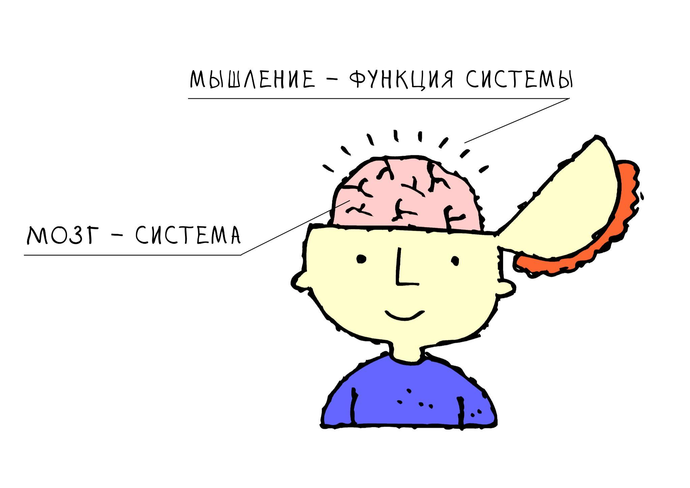

# 1.9. Мышление и интеллект

> **Основные понятия:** мозг, мышление, быстрое и медленное мышление, интеллект, мыслительное мастерство, неудовлетворенность, экзокортекс и экзотело.

### Неудовлетворенность и мышление

Мы уже рассматривали такую характеристику личности как агентность. Агентность — универсальная внешняя активность на основе внутреннего побуждающего желания. В конкретном случае в человеке возникает «нечто» — некий внутренний импульс, стимул, толчок, приводящий к действиям. Побуждение возникает в результате физиологических и психических процессов, и/или обусловлено влиянием окружения (в т.ч. социальной среды). Например, захотелось пить или посмотрев Instagram появилось желание купить что-то модное, а отсюда появилась активность. В психологии вводятся термины для обозначения этого внутреннего «нечто». Наиболее распространен термин «человеческая потребность» («потребность человека»), который используется в пирамиде Маслоу. Более свежие теории опираются на понятие **«неудовлетворенность»**, которые утверждают, что к действию человека приводит дефицит чего-то.

**Мозг человека** — это физический объект, он находится в реальном мире, его можно увидеть и даже потрогать, если постараться. А **мышлением** будем считать поведение — назначение, роль (функцию) мозга, которая неосязаема, которую невозможно потрогать. Мозг физичен, а мышление — абстрактно. Так же, как автомобиль — физичен, а движение — это функция автомобиля, которая абстрактна. Говоря про мозг и автомобиль, можно обсуждать их строение и состав, а поведение объектов обсуждается в терминах функций. Поэтому важно разделять в рассуждениях понятия «мозг» и «мышление», или систему и ее функцию.

Чтобы устранить неудовлетворенность, человек мыслит или производит мышление, а потом совершает автоматические или осознанные действия. То есть мышление — это способность проанализировать текущую ситуацию и выработать гипотезу относительно последующего действия. Либо бездействия.

Мышление может быть функцией мыслительного мастерства или прикладного мастерства. При этом само мышление, согласно книге Дэвида Канемана «Думай медленно, решай быстро» может быть **быстрым и медленным**. Быстрое мышление (S1) включается, когда нужно дать ответ о том, чему будет равно 2×2, а медленное мышление (S2) запускается, когда нужно перемножить 17×42.

Автоматические действия — это рефлексы и привычки, которые продиктованы быстрым мышлением. А осознанные действия совершаются под управлением медленного мышления. Быстрое мышление называют животным, инстинктивным, интуитивным, а медленное мышление называют осознанным, формальным, рациональным, логическим. При этом мы можем связать быстрое и медленное мышление с мыслительным и прикладным мастерством.

| Мышление / Жизненное мастерство | **Мыслительное мастерство** | **Прикладное мастерство** |
|--------------------------------|----------------------------|--------------------------|
| **Быстрое мышление (интуитивное, S1)** | Быстро находите решение проблем за счет того, что довели, например, системное мышление до автоматизма и поэтому можете выделить целевую систему в новом проекте. | Профессиональные автоматические действия. Например, когда имеете большой опыт вождения автомобиля. |
| **Медленное мышление (осознанное, S2)** | Задействуется при столкновении со сложными проблемами, когда требуется сконцентрировать все свое внимание на чем-то новом и сложном. | Осознанное применение профессиональных методов. Например, когда учитесь водить машину или когда нет автоматизма. |

Если возвратиться к примеру с 2×2=4, то сначала мозг человека распознает с помощью быстрого мыслительного мастерства, что речь идет о математике, а потом вызывает прикладное мастерство счета. Последнее сработало в автоматическом режиме, потому что человек уже знает ответ, быстрое мышление выдало его на интуитивном уровне. А когда необходимо было перемножить 17×24, то после быстрого мыслительного мастерства включается медленное прикладное мастерство перемножения в столбик.

Обратите внимание, в мыслительном мастерстве участвуют и биологический мозг, и экзокортекс. Однако в прикладном мастерстве задействуется все тело человека и, возможно, экзотело. Например, пловцу нужны только руки и ноги, а велосипедист использует экзотело — велосипед.

Итак, в прикладном мастерстве часто используется тело и экзотело, включая мозг и экзокортекс, а в мыслительном мастерстве мы ориентируемся на мозг (мышление) и экзокортекс.

Мы можем сказать, что человеческое тело (включая мозг) вместе с экзотелом (включая экзокортекс) — это физический объект. Когда мы рассматриваем человека с функциональной точки зрения, то говорим о жизненном мастерстве и неудовлетворенностях (желаниях). Соответственно, если человек что-то делает (устраняя неудовлетворенность), то это означает, что его жизненное мастерство осуществляет мышление и совершает действие, используя тело и экзотело. Собственно, функции жизненного мастерства — это мышление и действие.

Нас будет в первую очередь, интересовать мыслительное мастерство или интеллект, поэтому мы в большей степени будем говорить об интеллекте. Прикладное мастерство вы сможете развивать самостоятельно, и это будет высокоскоростное развитие — после усиления интеллекта. Интеллектуальное мышление будем называть просто — мышление, а если будет необходимо поговорить о прикладном мастерстве, то будем специально указывать, что речь идет о прикладном мышлении.

### Почему важен интеллект

В разные исторические периоды ценилось совершенно разное профессиональное (прикладное) мастерство. В эпохи охоты и собирательства, аграрного периода или в период конвейерного производства были востребованы разные знания и технологии. Каждая эпоха предъявляла свои требования к человеку, которому во все времена хочется жить счастливо, по меньшей мере, безбедно существовать.

Социальное неравенство создавало, казалось бы, непреодолимые границы, но инвестиции времени и средств в востребованную профессию позволяли как минимум не умереть с голоду, а при лучших раскладах радикально меняли траекторию жизни. Знания и освоенное профессиональное мастерство всегда были в почете и открывали возможности, о которых большинство не могло и помыслить.

Современный мир отличается от предыдущих эпох многократно возросшей скоростью изменений. Сегодня руководствоваться принципом выбора одной профессии на всю жизнь, который прекрасно работал для поколений людей, живших до нас, неэффективно, недальновидно и — очень рискованно. Профессиональные знания в одной-единственной области больше не могут гарантировать достойную жизнь на всем ее протяжении. Однако, скорость изменений в мире открывает человеку с высокой агентностью новые возможности для интересной жизни, но для этого требуется и развиваться по-новому.

На первый план выходит все то, что помогает быстрее перестраивать мышление человека, и, в частности, мастерство работы с новым и сложным. Конечно, узкие специалисты останутся в почете, но если вы заинтересованы в том, чтобы не дать никаких шансов одному из самых сильных человеческих страхов — страху неопределенности, страху нового, но напротив — новым интересоваться и оставаться всегда востребованным, то ваша главная цель — это постоянное развитие и усиление интеллекта одновременно с профессиональным развитием.

Заложенная природой бесконечная неудовлетворенность заставляет человека постоянно «шевелить шестеренками в мозгу» — или развиваться. При использовании экзокортекса происходит существенное ускорение мышления с одновременным повышением точности. Поэтому самое эффективное размышление — это мышление с помощью написания текста (**практика мышления письмом**). Размышляя письмом, можно сразу же прочесть свои только что зафиксированные мысли и осознанно работать с ними — корректировать и складывать в непротиворечивую модель описания мира (проекта, своей жизни или гипотезы решения проблем). Думая о чем-то новом, человек буквально отращивает себе мощную нейронную сетку — новые нейронные соединения физически прорастают — и он начинает мыслить все более сложными категориями, меняет взгляд на мир и привычные пути принятия решений.

Размышляя в течение дня письмом по рабочим, научным и личным проектам, мы не только документируем всю гамму актуальных ментальных моделей и наводим порядок в собственном ментальном пространстве — одновременно мы тренируем свой интеллект. Натренированный интеллект уже завтра позволит создавать пусть ненамного, но улучшенные рабочие продукты, нежели были созданы вчера. И пусть вас не смущает то, что на первых порах мыслить письмом может быть сложно, а выхлоп — незначителен. Первые шаги — самые важные, именно они приведут вас к качественным изменениям, а ежедневные тренировки создадут кумулятивный эффект — так вы сможете серьезно прокачать свой интеллект.

Человечество многое уже знает об устройстве мозга, но ещё большего — не знает. Например, точно неизвестно, какие физические (модульные) части мозга отвечают за научение новому и за решение новых проблем. Но мы выделим вниманием функциональную (не модульную) часть мозга, именно её и будем развивать — то, что называют интеллектом.
