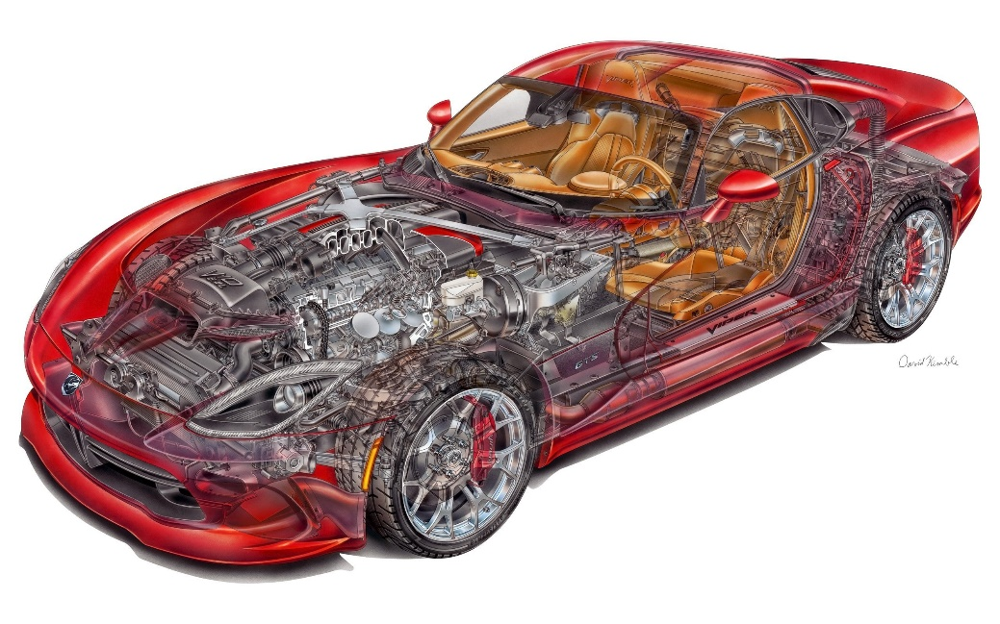

# 6.4. Понятие «система»

> **Основные понятия:** система, системные уровни, системный подход 1.0, свойства системы, целостность, эмерджентность, вложенность, метасистемный переход, 4D, физичность системы.

### Зачем нужна «система»

Понятие «система» является основополагающим в понимании создателем физической реальности. Данное понятие помогает создателю системно менять мир, делая его лучше. С помощью «систем» создатель думает о мире предметов и вещей. Здесь можно привести аналогию с физикой, в которой вводится понятие «физическое тело», под которым подразумевается материальный объект, имеющий массу, форму, объём. Далее в физике все рассуждения и законы привязываются к физическому телу, а когда физические законы применяются на практике, то «физическое тело» заменяется на соответствующий материальный объект: дорога, стул, ракета или поршень.

Такая же аналогия с понятием «система». Создатель, изучает системное мышление, и оперирует понятием система. Но потом в каждой предметной области он работает с конкретными системами. У кого-то системой будет готовый ко взрослой жизни ребенок, у другого — дом или обученный искусственный интеллект, а у третьего — выращенное дерево или другая природная система. Каждый человек осознанно или неосознанно создаёт свои системы. Деятельностный кругозор позволяет знать точные названия не только систем в предметной области, но и соответствующие названия ролей, методов и других системных понятий. Помните, что ранее инженера в парикмахерской называли парикмахер.

В конкретных проектах существуют множество систем, и «системы» выделяются из физического мира вниманием создателя или командой. Поставленное системное мышление означает наличие способности выделять системы, их описывать и создавать, а также совершать с ними определенные действия.

Человек не может рассматривать весь мир целиком, не хватит вычислительной мощности мозга. Вниманием человек выделяет важное из реальности (контекста), но и при этом старается не потерять связь этого важного с миром в целом. Понятие «система» позволяет управлять вниманием, а потому говорят, что системное мышление — это еще способность управлять вниманием.

*Рис. 6.3. Системные уровни на примере автомобиля*

Системное мышление ставится путём реализации рабочих проектов, в которых тренируется способность выделять системы и системные уровни вниманием. Например, на уровне мотора обсуждают его мощность, крутящий момент, а еще можно «уйти» вниманием внутрь мотора и рассматривать работу цилиндров, поршней, 2-х или 4-тактную работу, или качество топлива. Также можно «подняться» на системный уровень выше мотора и обсуждать весь автомобиль. Тогда внимание будет к скорости, цвету, дизайну, весу, цене автомобиля. В этом рассуждении приведены три системных уровня: на нижнем уровне — цилиндр и поршень, на втором — мотор, шасси, салон, на третьем — автомобиль.

*Рис. 6.4. Три системных уровня автомобиля*

Само понятие «система» пришло из биологии. Когда биологи рассматривали окружающую среду, то хотели её как-то описать и разложить на части. Например, выделяли отдельно растения, животных, ареал и т.п. Вырабатывались определенные методологические подходы, и ставка на понятие «система» оказалась наиболее эффективной. Из биологии пришли определенные понятия, которые перекочевали в другие сферы. Сейчас можно говорить о таком универсальном системном подходе, с помощью которого можем подойти к изучению любой человеческой деятельности.

Но прежде, чем говорить о современном понимании «системы», обратимся к классическому определению. Большинство системных методологий подразумевают под системой материальный, физический объект. В то же время в бытовом употреблении под «системой» могут пониматься какие-нибудь классификации, названия теорий и нормы жизни. Вы можете встретить слово «система» в самых разных названиях. Например, система Менделеева, философская система Платона и система Станиславского, система сдержек и противовесов, система моральных ценностей. Обращайте внимание теперь на то, когда услышите слово «система»: имеет ли ввиду физической объект или это объект ментального пространства. Мы далее будем работать с физическими объектами, а бытовые названия будем стараться называть другими словами. Например, вместо «система Менделеева» точнее говорить «таблица Менделеева» или «методология Менделеева».

Системное мышление требует обязательного разделения физических систем и «бытовых систем», которые так называются в повседневной практике, но могут не иметь материального воплощения в реальности. Поэтому, когда кто-то говорит про «системы», необходимо в первую очередь представлять, что за этой системой стоит в физическом мире. Системы — представляют физический мир, но их описания — это ментальное пространство.

Итак, **системы всегда физичны**, их всегда можно увидеть в реальности (хоть и в будущей реальности), то есть системы представлены в четырехмерном измерении (**4D**): трехмерное физическое пространство плюс время. По системам можно постучать, их можно потрогать, увидеть в физическом мире. Если не можете название системы связать с объектом физического мира, то значит, работаете не с системой, а с классификацией, с теорией, с описанием и другой ментальной сущностью.

### Классические свойства системы

В системном подходе система является не только материальным объектом, она обладает тремя важными свойствами: **целостность**, **эмерджентность** и **вложенность**.

*Рис. 6.5. Классические свойства системы*

Свойство **«целостности»** подразумевает, что система имеет границу, и связь частей системы между собой намного сильнее, чем связь с другими объектами физической реальности. Данное свойство помогает выделять системы своим вниманием. В инженерных системах типа «стол» или «автомобиль» проблем с границами не возникает, но когда рассматриваем сложные системы, то границы находить непросто. Например, системами считаются: система безопасности на водах, система выдачи пропуска или система отопления. Чтобы выделить в физическом мире данные системы, необходимо определить и перечислить физические объекты, которые входят в состав данных сложных систем. Так, в систему безопасности на водах могут входить спасатели, смотровые вышки, спасательные круги, лодки и т.п. Таким образом, своим вниманием создатели очерчивают границу системы и тем самым решают, что связи между данными частями системы будут намного сильнее, чем с другими объектами физической среды.

**Эмерджентность** означает, что у системы появилась новая функция, которой не было у каждой из её частей. Данное слово с английского переводится как «возникновение, появление». Эмерджентность ещё называют «системным эффектом». Любая система обладает свойством эмерджентности, а иначе это не система, если невозможно назвать функцию данной системы.

Свойство эмерджентности помогает обсуждать разные системные уровни, не теряясь между ними. На разных системных уровнях различаются между собой функция поршня, функция мотора и функция автомобиля. Такой переход с одного системного уровня на другой называется **метасистемный переход**. На каждом системном уровне появляется определенная функция какой-то системы, или проявляется её эмерджентность.

Главное в общении опытных специалистов не ловкое жонглирование профессиональными терминами, а беглость метасистемного перехода. Профессионал хорошо понимает эмерджентное свойство на каждом системном уровне в своей предметной области. Для человека с системным мышлением подобные обсуждения не простой поток слов и букв, он буквально слышит или вычитывает понятия из разных системных уровней, понимает связь между ними.

Системные уровни построены по принципу **вложенности** одного уровня в другой. Вложенность можно представить как матрешку: буквально одна система входит в другую систему, которая для нее будет надсистемой. Свойство вложенности означает, что любая система сама является надсистемой для каких-то систем, а также входит в какую-то большую надсистему. Если говорим, что у нас есть система, то у нее автоматически есть подсистемы и надсистема.

Все три вышеперечисленных свойства помогают выделять системы из физического мира, удерживать внимание на самой системе и при необходимости рассматривать её устройство (подсистемы), а также не терять связь системы с физическим миром (надсистема).

Рассмотрим пример — система «часы». Во-первых, всегда можно представить данную систему в физическом мире. Часы обладают свойством целостности, у них есть граница и части системы «часы» связаны между собой сильнее, чем с другими объектами физического мира (где-то система заканчивается, а дальше уже не система). Часы имеют эмерджентное свойство, а именно у часов есть функция — показывать время. Данная функция появляется, только когда все части часов собраны вместе. Но ни у каких частей системы нет такого свойства, оно появилось у системы в целом. Вложенность заключается в том, что каждая деталь часов является частью всей системы, а часы входят в состав вещей, надетых на человека.

Таким образом, когда подводим итог рассмотрению классического понятия «система» или так называемый **системный подход 1.0**, то необходимо выделить главное:

- системы помогают человеку понимать реальность путём выделения важного из физического мира и при помощи управления вниманием обсуждать разные системные уровни;
- требуется разделять системы физические и системы из бытового сленга, которые могут не иметь физического воплощения;
- системы обладают свойствами целостности, эмерджентности и вложенности.
