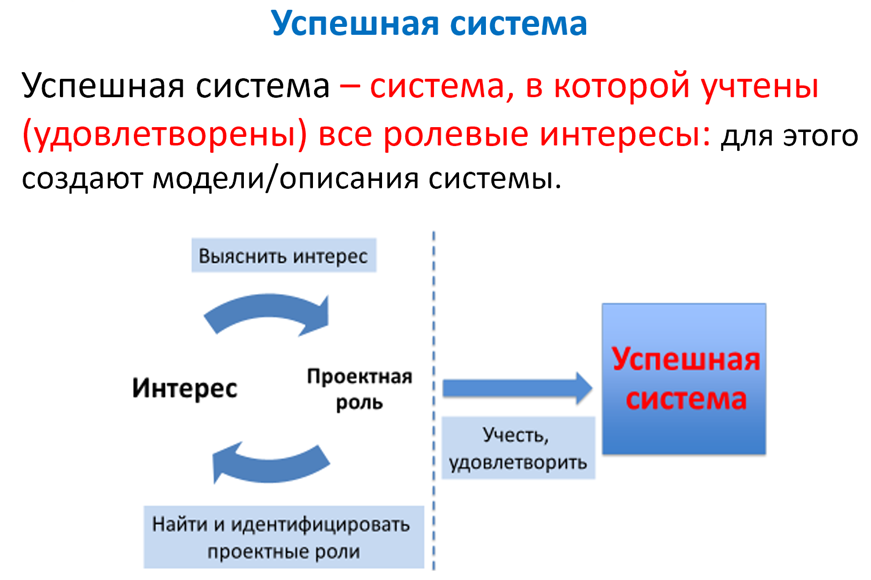

# 6.5. Системный подход

> **Основные понятия:** системный подход 2.0, системный подход 3.0, успешная система, проектные роли, ролевой интерес, заинтересованные лица, системное описание, учесть и удовлетворить интересы, неустроенности, безмасштабность.

### Системный подход 2.0

В первой версии системного подхода, который формировался Л.фон Берталанфи, системы рассматривались как материальные объекты. Объективное рассмотрение систем подразумевало, что системы — это объекты, и они обсуждались независимо от субъектов. Поэтому в системном подходе 1.0 можно обсуждать просто стол или автомобиль, и находить в этих системах разные свойства систем — целостность, эмерджентность, вложенность.

Методологии системного подхода 2.0 кардинальным образом отличались от классических теорий времен Берталанфи. Хотя большинство людей, получивших образование в XX веке, этого не осознают.

Системный подход 2.0 не отвергает классические свойства системы. Система обязательно физична и обладает свойствами целостности, эмерджентности и вложенности. Это всё необходимые условия. Однако в современной трактовке понятие «система» обзаводится новыми свойствами, которые вытекают из субъективного взгляда на систему.

В классическом рассмотрении «система» существует как объект в любое время, а в современном рассмотрении «система» как объект выделяется заинтересованными людьми и существует только тогда, когда эти интересы сохраняются. Классический подход больше философский и рассматривает идеальные объекты, а современный подход — прагматичный и рассматривает объекты, которые кому-то зачем-то нужны, или системы как-то влияют на кого-то.

Системное мышление 2.0 не применяется, когда нужно просто без реального проекта поговорить о столе, часах, автомобиле. Это идеальные объекты ментального пространства, часто в разговоре за ними не представляются конкретные физические объекты. Системное мышление 2.0 начинает применяться к системам «стол офисный», «часы наручные», «автомобиль легковой», то есть в этом случае хотя бы можно говорить об интересах и заинтересованных ролях, которые что-то хотят от системы.

Системный подход 2.0 обращает внимание на заинтересованных лиц и на роли, которые они играют по отношению к системе. Исходя из этого определяется система, её границы и системный эффект, а также — как будет использоваться система. Совокупность всех интересов проектных ролей определяет, какой будет система, какая будет у нее функция, из чего будет состоять система и т.п. Например, автоконцерн создаёт легковой автомобиль с учётом возможных интересов потенциальных клиентов в ролях водителя, пассажира, эксплуатанта, собственника, пешеходов, контролирующих органов, защитников окружающей среды и т.п.

*Рис. 6.6. Системный подход 2.0 — взгляд снаружи системы*

Каждый учтенный интерес определяет то, каким должен быть автомобиль. Например, если не было бы экологического интереса, то не нужно было бы ставить подсистему очистки выхлопных газов, которая соответствует стандарту Евро-6. А поставив такую подсистему в автомобиль, производитель поменял устройство системы. Всё, что сделано в легковом автомобиле, является ответом на какой-то интерес проектной роли, который автопроизводитель решил учесть. Система «легковой автомобиль» будет успешной, если будут учтены (удовлетворены) интересы всех заинтересованных лиц (проектных ролей).

В системном подходе 2.0, когда говорят про систему, то автоматически подразумевают, что есть заинтересованные лица по отношению к этой системе. Заинтересованными признаются все проектные роли, которые как-то влияют на систему, или система может затронуть людей в определенных ролях. От этого взаимодействия системы и проектных ролей зависит граница, функция и устройство системы. Поэтому обсуждение системы начинается не с внутреннего устройства системы, а с понимания окружения системы. То есть в какую надсистему входит система, кому она нужна и что этим заинтересованным сторонам необходимо, какие у них проблемы и какие требования они выдвигают к системе. Отсюда возникает важный системный прием: **всегда начинать смотреть вовне системы, а только потом вовнутрь**.

Например, в классическом рассмотрении системы «часы» человек начал бы разбираться со свойствами системы и обратил внимание внутрь системы, то есть начал обсуждать, из чего состоит система. В современном рассмотрении необходимо начинать со взгляда вовне системы, то есть смотреть, частью какой надсистемы являются часы, кому они нужны и как используются. После такого рассмотрения понимаешь, что речь идет о часах наручных, или о часах с кукушкой, или о часах в составе башни. При этом устройство всех этих часов будет разным.

Таким образом, в системном подходе 2.0 системы не просто обладают свойствами целостности, эмерджентности и вложенности, но их важное свойство состоит в том, что системы зависят от заинтересованных лиц (проектных ролей). От удовлетворения интересов проектных ролей зависит успешность системы, поэтому рассмотрение системы начинается с её окружения: сначала смотрим вовне, а только потом внутрь системы.

### Успешная система

Лучшая демонстрация системного мышления — это созданная **успешная система**. Успешность системы определяется тем, что учтены (удовлетворены) интересы всех заинтересованных лиц. Причем в современном мире скорость работы над созданием системы будет одним из главных интересов, поэтому важно, чтобы команда владела системным мышлением. Общекомандное системное мышление означает регулярное ускорение процесса работы над созданием успешной системы.

Прежде чем приступить к созданию системы, необходимо выявить всех заинтересованных лиц и посредством моделирования сделать системное описание. Общее системное описание должно устроить все проектные роли, интересы которых команда посчитает целесообразным учесть при создании системы. И тогда создается система.

*Рис. 6.7. Путь к созданию успешной системы*

В руководствах системного мышления описывается то, как провести каждое действие на приведённой схеме: «найти и идентифицировать», «выяснить», «учесть, удовлетворить».

В приведенной схеме важно понимать отличия между терминами **«учесть»** и **«удовлетворить»**. Учесть необходимо все выявленные внешние и внутренние роли. Под этим подразумевается, как минимум, рассмотрение интересов всех ролей и осознанное решение о том, что эти интересы будут или не будут удовлетворяться в создаваемой системе. Решение о том, что чьи-то интересы не будут удовлетворены, означает, что команда понимает последствия такого решения. В этом решении нет ничего неправильного, поскольку абсолютно все интересы удовлетворить невозможно.

Удовлетворение конкретного интереса начинается с того, что составляется соответствующее описание системы, которое отвечает на данный интерес. Прежде чем создавать систему, необходимо сделать её описание, используя системные понятия и понятия соответствующих прикладных дисциплин. Не обязательно системное описание должно быть полным. Например, для старта определенных работ по созданию системы достаточно архитектурного описания, а рабочее проектирование может идти параллельно с созданием или даже с частичной эксплуатацией системы. Как это всё организовать и не допустить бардака, также определяется в системном мышлении.

В современном мире нельзя недооценивать значимость работ с описаниями системы. Стадии замысливания и проектирования становятся всё более важными, чем стадии производства и эксплуатации. Бюджеты этих первых стадий могут быть намного больше, чем бюджет производства, а часто эти первые стадии никогда не заканчиваются, потому что системы постоянно совершенствуются. Большинство высокопрофессиональных специалистов работают с различными описаниями системы.

Офисные работники также имеют дело с описаниями каких-то систем, причем все описания между собой связаны. Например, бухгалтер формирует налоговое описание системы предприятия, кадровик составляет описание предприятия в части трудовых ресурсов, финансист создаёт описание управленческого учёта, менеджер может создавать большое количество описаний о проекте, а системный инженер — разные описания продукта, который создаётся в рамках проекта. При этом сам проект находится в рамках предприятия. Само предприятие можно разбить на множество проектов и процессов, на которые так же можно посмотреть, как на системы.

Каждый специалист работает со своим описанием системы, но если он одновременно обладает системным мышлением, то он из простого исполнителя вырастает в заметную фигуру. Вашему пониманию сути происходящего в проекте или на предприятии позавидуют опытные работники, поскольку системное мышление помогает любому специалисту быстро разбираться в общих вопросах системного описания деятельности всего предприятия или создаваемой системы. Неформальное звание «толковый специалист» является результатом работы вашего интеллекта, который может быть быстрее всего усилен за счёт постановки системного мышления.

Чем больше компания и чем сложнее создаваемая система, тем, соответственно, больше востребованы люди, которые умеют работать с описаниями, с разными картинами мира на разных системных уровнях. Понимание, как ваше ролевое описание встраивается в общее системное описание, открывает глаза, и ранее сложная деятельность становится простой, а стрессы и беспокойства отступают. Без системного мышления сложно работать в таких коллективах: вам придётся каждый раз делать что-то неосознанно, не будете представлять, чего хотят другие люди (не видеть их роли), не сможете «положить» всю деятельность предприятия к себе в голову. Поставленное системное мышление помогает шаг за шагом разобраться в сложной деятельности и далее системно и систематично её улучшать.

Для того чтобы поставить системное мышление, необходимо на первом этапе получить знания понятийного минимума, и далее тренироваться в составлении системного описания (эссе по учебному и далее по рабочим проектам). В каждой главе руководств системного мышления определяются понятия, принципы, рабочие продукты, которые позволяют составить итоговое эссе по проекту создания системы. Системное эссе включает описание:

- предпринимательской области интересов, включая интересы клиентов и других внешних проектных ролей, возможности и потребности, описание систем в окружении и системных уровней, концепцию использования;
- инженерной области интересов, включая концепцию системы и её архитектуру, а также различные описания системы исходя из выявленных интересов, которые было решено удовлетворять;
- менеджерской области интересов, а именно стадии и этапы работ, необходимые ресурсы, технологии, роли и т.п. для всего проекта.

Есть ли разница в системном мышлении для разных специалистов? Нет, системное мышление универсально. Любой специалист должен на минимальном уровне уметь составлять системное описание, а детализация происходит исходя из знания прикладных практик конкретных областей интересов.

Как думать о системах разным специалистам? Используя понятия системного мышления, с помощью которых сначала составлять системное описание, а потом создавать успешную систему.

Таким образом, системное мышление демонстрируется в скорости создания успешных систем, а для этого необходимо уметь работать с разными интересами, которые учитываются (удовлетворяются) путём составления системного описания. Несмотря на всю свою привлекательность, системное мышление не совсем рыночный продукт. За ним не стоит очередь, но только потому, что его невозможно просто купить, его подчас нужно выстрадать, или серьёзно «поломать голову» над рабочими проектами.

### Системный подход третьего поколения

Несмотря на то, что во многих вузах еще преподается классический системный подход первого поколения, мы говорим, что даже второе поколение системного подхода уже устарело. Конечно, оба поколения системного подхода имеют право на дальнейшее существование, и они не отвергаются полностью. Однако, наука пошла дальше.

Современные проблемы требуют современных решений, и **системный подход третьего поколения** предлагает именно такие решения, опираясь на эволюционную теорию. Он акцентирует внимание на неустроенностях между системными уровнями, которые часто становятся корнем сложных глобальных проблем.

Конфликты окружают нас повсюду: на микроуровне бактерии атакуют человеческий организм, на уровне экосистем — природные катаклизмы ставят под угрозу наше существование, на общественно-политическом уровне — государства сталкиваются с внутренними и международными противоречиями. Даже на космическом уровне мы подвергаемся риску: астероиды и другие космические угрозы нависают над всей планетой.

Например, говоря про агента, который может исполнить роль, мы можем иметь в виду не только человека, но и ИИ, команду людей или совокупность предприятий. Само мышление будет не зависеть от исполнителей ролей.

Скрещивание системного подхода с эволюционными теориями позволяет надеяться, что можно решить многие проблемы, которые стоят перед цивилизацией за счет техноэволюции. Мы можем объединиться в сообщества, стремящиеся найти решения для проблем на многих системных уровнях. Мы можем бороться за сохранение природы, отражать космические угрозы, разрабатывать новые лекарства от болезней и защищаться от природных и социальных бедствий.

В этом процессе критически важны люди, которые владеют системным мышлением и способны создавать эффективные системы на всех уровнях. Нам нужно значительно расширить сообщество системных мыслителей, что возможно через переосмысление образовательных стандартов:

- интеллект-стек вместо традиционного STEM образования может быть ключом к глобальным изменениям на всех системных уровнях;
- повсеместная новая грамотность на основе формально выделенных практик ученика, помогут большому числу людей быстро учиться сложному.

Именно такой подход к образованию может дать нам необходимые инструменты для борьбы с вызовами будущего и способствовать созданию устойчивого мира для всех живых существ. Это может оказаться гораздо более мощным рецептом изменения мира, чем многие другие подходы.

Более подробно о том, как использовать системный подход третьего поколения изучайте в руководстве «Системное мышление».
