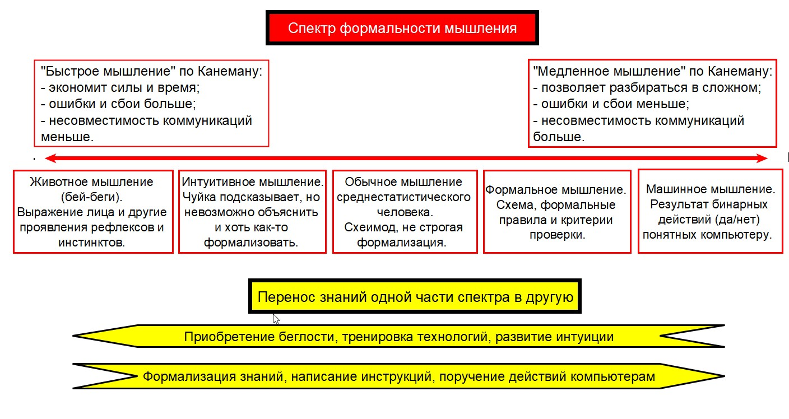

# 2.7. Модели обучения

> **Основные понятия:** неосознанная некомпетентность, осознанная некомпетентность, осознанная компетентность, неосознанная компетентность, животное мышление, интуитивное мышление, обывательское мышление, формальное мышление, машинное мышление; этапы постановки привычки — «Надо или любопытно», «Могу», «Хочу», «Не могу не», квадрант компетенций, спектр формальности мышления, привычка, модели обучения.

Существует множество теорий (моделей) того, как происходит обучение человека. В зависимости от целей можно пользоваться разными моделями, каждая из которых отвечает на свои вопросы. Познакомимся с моделями «Квадрат компетенций», «Спектр формальности обучения» и «Этапы постановки привычки». Все три модели можно связать между собой, они направлены на объяснение процесса обучения и не противоречат друг другу. Например, модель стадий обучения лучше объясняет, как человек осознает уровень своего текущего мастерства. Рассматриваемые в следующих разделах модели спектра формальности мышления и этапов постановки привычек показывают другие аспекты обучения.

### Стадии обучения: от неосознанной некомпетентности к неосознанной компетентности

С помощью квадрата компетенций можно описать осознанное обучение. Для этого выделяется 4 стадии:

**1. Неосознанная некомпетентность.** Чтобы начать чему-то учиться, надо сначала узнать о существовании этого. Аборигены, живущие в джунглях, находятся в неосознанной некомпетентности относительно знаний человеческой цивилизации и могут даже не знать о планете Земля или думать, что планета плоская. Точно также многие работники не догадываются о существовании «методов» и «трансдисциплин», они просто «работу работают». Чтобы перейти от неосознанной некомпетентности к следующей стадии «осознанной некомпетентности», необходимо узнать о существовании какого-то знания (теории) или технологии, то есть того, чему можно научиться. Как говорил Сократ: «я знаю, что ничего не знаю, но другие не знают даже этого». То есть, большинство людей находятся на стадии незнания того, чего они и не могут знать, имеют «слепое пятно». И могут даже об этом не догадываться.

**2. Осознанная некомпетентность.** Когда человек узнает о существовании теории (знания, дисциплины) или инструмента, то он может осознать, что не имеет компетентности в данной сфере деятельности или не знает, как пользоваться инструментами. Без этого осознания своей некомпетентности невозможно начать учиться. Именно осознание того, что человек не имеет ответов на большинство вопросов об устройстве мира, в отличие от религии, привело к научной революции: человек осознал, что многого не знает, и перестал довольствоваться ответом о том, что «на всё есть воля божья». Чтобы начать учиться чему-то или исследовать неизведанное, необходимо осознать и принять, что существующие (ранее загруженные в голову) картины мира не дают необходимого объяснения реальности, и нужно подбирать новые, для чего важно умение выбирать хорошую теорию. А чтобы новое объяснение «улеглось» в голове, нужно осознанно встать в роль ученика и разобраться с понятиями и принципами теории. После чего произойдет переход на следующую стадию обучения.

*Рис. 2.5. Четыре стадии развития компетентности*

**3. Осознанная компетентность.** Разбираясь в теории (дисциплине, моделях), человек получает профессиональные знания, а если учится использовать инструменты в соответствии с теорией, то получает мастерство. Например, после курсов вождения человек овладевает методом управления транспортным средством и может водить машину (освоил роль водителя). Он полностью концентрирует свое внимание на окружающей обстановке и старается выполнять все то, чему учили в теории. Вчерашний ученик отслеживает все свои действия и подчас не может расслабиться за рулем. Чтобы перейти на следующий уровень мастерства, ему необходимо время на тренировку, или так называемый «налет часов».

**4. Неосознанная компетентность.** На данной стадии человек инвестирует время в беглость мышления. Постоянно находиться в осознанной компетентности или постоянно использовать медленное мышление — довольно энергозатратное занятие. Поэтому мастерство часто доводится до автоматизма, то есть, медленное мышление должно становиться быстрым. Например, «налет» часов езды на автомобиле делает свое дело, и через некоторое время вождение не доставляет такого дискомфорта, как когда компетенция была осознанной. Профессиональный пианист тоже не концентрирует внимание на том, какую ноту или аккорд нужно выдать и в какой последовательности.

Высшей квалификацией, «истинным мастерством» (когда о человеке говорят «ну он мастер») будем считать именно неосознанную компетентность. К этой квалификации необходимо стремиться в любой деятельности, которой вы решили заняться по-серьезному, особенно в прикладных методах. И этого вполне можно достичь посредством бесконечного и непрерывного развития, если вы будете проходить все стадии обучения, изучать дисциплину и инвестировать достаточно времени, чтобы получить беглость в знаниях и во владении технологией.

### Спектр формальности мышления для процесса обучения

«Спектр формальности мышления» — это модель о том, как наш мозг работает с разными картинами мира и как он взаимодействует с физическим миром. Подробно данная модель, предложенная Прапион Медведевой, разбирается в руководстве «Рациональная работа», а здесь с помощью спектра формальности мышления объясним процесс обучения.

Спектр формальности мышления базируется на модели мышления, которую предложил Дэниэль Канеман в книге «Думай медленно, решай быстро». Канеман условно разделил мышление человека на быстрое и медленное.

В спектре формальности мышления используется не бинарное разбиение Д.Канемана (на быстрое и медленное мышление), а выделены и другие варианты функционирования мозга. На спектре мы можем расположить несколько вариантов поведения мозга, что позволяет лучше определять действия человека и создаваемые им рабочие продукты. При этом можно говорить, что есть левая часть спектра, или быстрое мышление, и правая часть спектра, или медленное мышление.

*Рис. 2.6. От животного к машинному мышлению*

**Животное мышление** заложено природой, и проявляется это поведение через рефлекторные действия. В ответ на воздействие окружающей среды и/или с помощью чувств человек определяет контекст сложившейся ситуации и действует исходя из заложенных эволюцией программ. Например, мы можем резко отдернуть руку от огня или невольно скорчить гримасу, если неприятен разговор.

Опыт и привычки также формируют автоматическое мышление. В отличие от животных, которым такие автоматизмы даются природой, человек приобретает их в течение жизни. Благодаря им создается **интуитивное мышление**, которое обычно включается, когда человек распознает знакомую ситуацию и использует заложенные ранее в голову картины мира (дисциплины) и поставленные автоматизмы в применении технологий. Канеман приводит пример пожарных, которые буквально чувствуют, что может произойти в следующий момент при пожаре. Интуицию невозможно формализовать, поведение человека похоже на животное мышление, но это выученное поведение.

Обычное поведение человека, как мы говорили ранее, основано на симбиозе формальных теорий и ненаучных моделей мира. Для большинства жизненных решений не нужна большая точность моделей реальности, вполне достаточно прикинуть что-то в уме или на салфетке. То есть, помимо интуиции здесь уже появляются зачатки формализации. Могут строиться простые и нестрогие модели, которые называем схемоидами. Модели строятся с помощью тех картин мира, которые получены человеком ранее. Содержание схемоида содержит описание конкретной жизненной ситуации. Например, человек может прикинуть в уме свой маршрут путешествия и понять, сколько литров бензина ему понадобится, а также — сколько это примерно будет стоить.

В обычной жизни точность не всегда важна, но иногда случаются ситуации, когда с наскоку проблема не решается. Тогда требуется создавать более строгие схемы/модели, чтобы разобраться обстоятельно и принять обдуманное решение. Для этого нужно обратить внимание на способ мышления, то есть на то, «как я думаю и как действую». Можно говорить про **формальное мышление**, когда человек использует определенную практику для решения какой-то жизненной ситуации. Например, пловец хорошо знает понятия дисциплины кроль и в момент тренировки у него может работать формальное мышление, которое отслеживает все действия согласно практике.

Когда же стоимость последствий принимаемых решений высока, требуются более точные вычисления. Максимальная формализация требует значительных ресурсов времени и средств, поэтому чаще используется в рабочей деятельности, чем в личной жизни. Формальные вычисления на работе обычно относятся к рациональному мышлению (рациональному принятию решений). Также существует **машинное мышление** — совокупность или цепочка бинарных операций, которые точным математическим образом расписаны и просчитаны. Если какую-то деятельность можно описать таким способом, то её выполнение можно поручить компьютеру. Роботизация как раз имеет целью строго описать решения или научить машину самостоятельно принимать их лучше, чем это делает человек.

Осознанное или формальное обучение можно представить следующим образом. Человек сначала «включает» формальное мышление из правого спектра, чтобы разобраться с теорией/дисциплиной. Он осознанно раскладывает дисциплину по полочкам, и таким образом «закладывает в голову» формальные модели мира. Этот процесс освоения сложных картин мира намного эффективнее и быстрее, чем изучение образцово-показательного выступления мастера или освоение технологии сразу в жизни без изучения теории.

Осознанное обучение дисциплине начинается с изучения понятий, принципов, правил и моделей, при котором человек задействует правый спектр мышления. Внимание сосредотачивается на том, как устроено какое-то описание мира, какая-то теория. Например, поэтапно на протяжении длительного времени будущий водитель изучает дорожные знаки и правила дорожного движения.

После изучения теории (или одновременно) человек начинает осваивать выбранную технологию, которая поддерживает данную дисциплину. Освоение технологии также важно проводить осознанным образом, а не исподволь. Инструктор по вождению вряд ли будет развлекать студента, который должен сконцентрировать внимание на дорожной обстановке. Опрометчиво ученику тратить ресурс внимания на игровую форму обучения, которая своей простой и притягательностью уводит внимание от тренировки дисциплины и освоения технологии. Это ещё один аргумент, почему нет легких дорог к сложному мастерству: вождение, как и многие другие дисциплины, не преподается в игровой форме. Математический анализ или алгебра постигается путем вставания в роль ученика, который далее «набивает руку» на решении задач. Системное мышление изучается почти также, но ещё необходимо заложить время на реализацию своего рабочего проекта.

Тренировка использования инструментов происходит в течение определенного времени. Чтобы научиться кататься на велосипеде, потребуется меньше времени, чем на обучение вождению автомобиля. Количество времени на освоение практики (дисциплины и технологии) зависит от уровня подготовки человека или от его мастерства собранности, то есть, от того, насколько он владеет собой и умеет концентрировать внимание на деле, может планировать исполнение роли ученика и дисциплинированно вставать в неё в течение определенного периода, а также от его интеллекта. Тем не менее, мы можем сказать, что время — это важный и необходимый фактор для перестройки мышления и закрепления нового поведения.

Тренировка использования инструментов призвана автоматизировать новый навык. Пилот нарабатывает «часы налета» на тренажере и в самолете, а чтобы стать водителем, нужно до автоматизма довести свои действия по управлению авто. Постоянная концентрация внимания на исполнении своих действий требует значительных усилий и времени, которые мы инвестируем в изучение новой практики, при этом формальное мышление переводится в интуитивное. То есть, сначала задействуется формальное мышление правого спектра, и далее, тренируясь, человек переводит свое мышление в левый спектр, где реализация практики осуществляется почти неосознанно, быстрее и без особых затрат энергии.

Сопоставьте тот период, когда вы только начинали ездить за рулем, кататься на лыжах, делать новую работу, и текущий уровень мастерства, при котором вы уже не тратите столько энергии и непринужденно выполняете все действия по прикладной практике. Таким же образом можно ставить хорошие привычки, которые станут автоматизмами при помощи осознанного обучения.

### Этапы постановки привычки

На спектре формальности мышления было показано, что мастерство доводится до автоматизма посредством перевода мышления из медленного правого в быстрый левый спектр мышления. Профессионал или мастер в однотипных ситуациях действует на автомате, экономя внимание (энергию, жизненные силы). Автоматизм определенных действий вшит в нас природой. Некогда думать в правом спектре мышления, если вы случайно обожглись. Рефлексы определяют наше поведение, а определенные желания (потребности, неудовлетворенности) мы осуществляем на автомате. Например, любовь к сладкому или сексуальное влечение. Но есть автоматизмы поведения, которые формируются в течение жизни. Их называют привычками. Привычки могут быть мыслительным или профессиональным мастерством.

Привычки могут закладываться нашей осознанной деятельностью, и тогда мы будем говорить про постановку метода. Но часто привычка закладывается без нашего осознанного внимания и под воздействием социальной среды. К сожалению, в таком случае обыватель не сильно отличается от животного в ящике Скинера или от собаки Павлова. Плохие привычки — это отражение в нашем поведении социальных стереотипов и потакание животным желаниям. Поставщики контента, как мы говорили ранее, научились воздействовать на наши неудовлетворенности и умело закладывают свои картины мира, чтобы предопределить наше поведение в определенных ими ситуациях.

Насколько привычка плоха каждый человек должен решить самостоятельно, но можно дать три критерия, каждый из которых может указывать на то, что привычка является плохой:

- наносит ли она ущерб вашему организму;
- не забирает ли ваше время, которое можно было бы инвестировать с большим толком;
- страдают ли от вашей привычки другие люди.

*Рис. 2.7. Три критерия для оценки привычек*

Осознание своих привычек — непростое дело. Сложившиеся картины мира и устоявшееся поведение сложно поставить под сомнение, а изменить паттерны поведения ещё сложнее. Тем более что моральные и этические принципы сугубо индивидуальны, и не хотелось бы давать универсальных советов по поводу того, что такое «хорошо» и что такое «плохо». Поэтому домашнюю работу над своими плохими привычками каждый должен делать самостоятельно. При этом желательно выработать собственные критерии отнесения своих регулярных действий к плохим привычкам. Если вы осознали свои плохие привычки, не впадайте в беспокойство. Вместо это лучше выстройте этапы замены этих привычек на полезные.

В модели постановки привычки или личной практики выделяются 4 этапа:

**1. «НАДО или ЛЮБОПЫТНО».** Из внешней среды мы получаем какой-то сигнал, который резонирует с уже заложенными ранее картинами мира (скорее всего, неосознанно). В результате у нас формируется мысль предпринять какие-то действия. Нам могут говорить родители, коллеги, мы можем сами догадываться, что пора что-то делать, или же у нас возникло любопытство в отношении чего-то, и нам захотелось это попробовать. Например, надо похудеть, надо заняться спортом, надо выучить системное мышление или любопытно прыгнуть с парашютом, заняться дайвингом, поуправлять дроном.

**2. «Могу».** Отрабатывая теорию в процессе освоения технологии, мы постепенно достигаем умений. На этом этапе начинает действовать накопительный эффект, который дает наибольший эффект на следующих этапах. Регулярные тренировки по плаванию или реализация практики бухгалтерского учета оттачивают мастерство в получении рабочих продуктов.

**3. «Хочу».** Не путаем порывистое желание заняться новой деятельностью с результатом инвестированного времени в виде осознанного желания. Истинное желание «хочу» возникает после того, как вы получили прикладной навык.

**4. «Не могу не».** Это означает, что данная деятельность становится обязательной в вашей жизни, и вы не можете без неё жить. Радость потоковых переживаний высока, и вы их регулярно получаете, занимаясь данной прикладной практикой. То есть, вы зависимы от такой деятельности на физиологическом уровне. При этом вы постоянно совершенствуете свое мастерство, повышая сложность решаемых задач.

*Рис. 2.8. Четыре этапа формирования привычки*

Приведенная модель «Этапы постановки привычки» подходит не всем, но каждый может усовершенствовать её или создать свою модель, которая поможет потенциальные жизненные интересы перевести в привычку.
